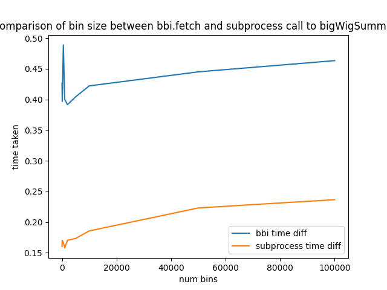
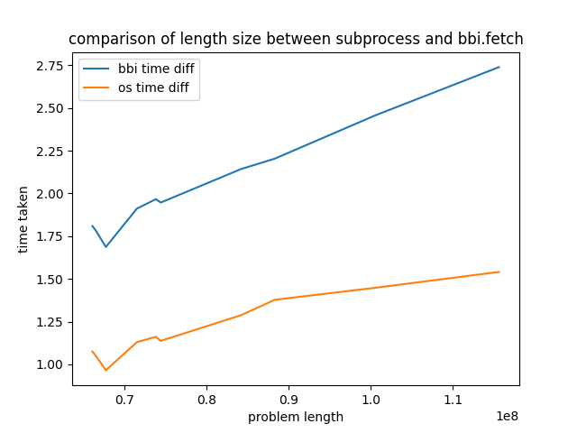

# Compare BBI
A comparison between pyBBI and bigWigSummary

## Results
Results from the tests

The below graph shows the results comparing a call to bigWigSummary using subprocess and bbi

The Below graph shows the results comparing a call to bigWigToBedGraph using subprocess and bbi

## Running
1. clone and setup [RandomTests](https://github.com/deltarod/RandomTests/)
6. `python3 -m pip install pybbi`
7. `python3 compareBBI/bwFullTest.py`
7. `python3 compareBBI/bwSumTest.py`