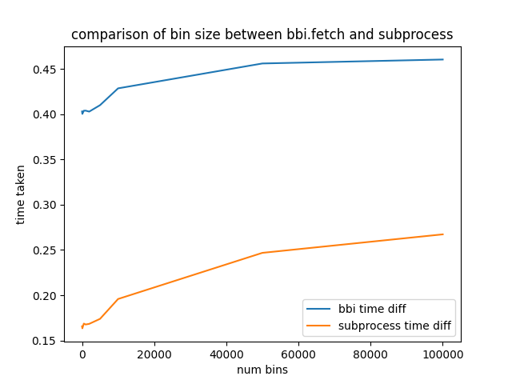

# Compare BBI
A comparison between pyBBI and bigWigSummary

## Results
Results from the tests

The below graph shows the results comparing a call to bigWigSummary using subprocess and bbi

The Below graph shows the results comparing a call to bigWigToBedGraph using subprocess and bbi

## Setup
1. clone and setup [RandomTests](../)
1. `cd compareBBI`
2. `wget http://hgdownload.soe.ucsc.edu/admin/exe/linux.x86_64.v385/bigWigSummary`
3. `wget http://hgdownload.soe.ucsc.edu/admin/exe/linux.x86_64.v385/bigWigToBedGraph`
4. `sudo chmod a+x bigWigSummary`
5. `sudo chmod a+x bigWigToBedGraph`
6. `python3 -m pip install pybbi`
7. `python3 run.py`