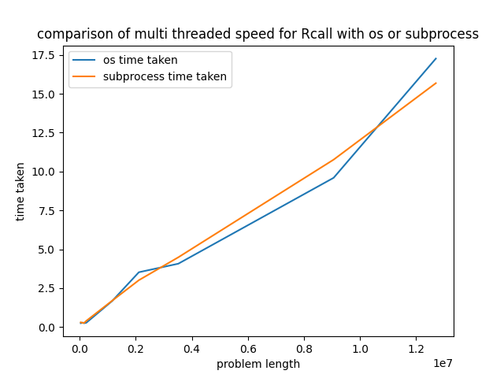

# Compare System Sub Process
Comparison between os.system and subprocess.run for running PeakSegDisk via RScript

## Results

These are the results for comparing between os.system call and subprocess.run calls to an R script using Rscript in a single threaded fashion

These are the results for comparing between os.system call and subprocess.run calls to an R script using Rscript in a multi threaded fashion

## Running
1. `python3 compareRscriptCall/run.py`